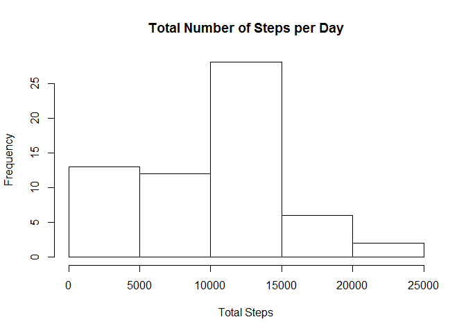
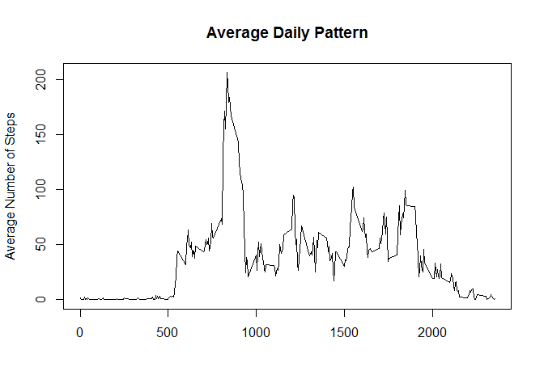

# Reproducible Research: Peer Assessment 1

I've tried to finish the assignment, but only had enough time and skills to tackle on the first three objectives.

## Loading and preprocessing the data

Have the activity.csv extracted from the .zip before proceeding.


```r
activity <- read.csv("activity.csv",stringsAsFactors = FALSE)
```


## What is mean total number of steps taken per day?

This is a histogram of the total number of steps taken per day.


```r
a <- tapply(activity$steps,activity$date,sum, na.rm=TRUE)
hist(a,main="Total Number of Steps per Day",xlab = "Total Steps")
```

 

```r
#hist(a)
```

The mean and median are reported below.


```r
mean(a)
```

```
## [1] 9354
```

```r
median(a)
```

```
## [1] 10395
```


## What is the average daily activity pattern?


```r
a <- tapply(activity$steps,activity$interval,mean, na.rm=TRUE)
answer = as.data.frame(as.table(a)) 
colnames(answer) <- c("Interval","AvgSteps")
time_interval <- as.numeric(levels(answer$Interval))
avg_steps <- as.numeric(answer$AvgSteps)
#plot(answer$Interval,answer$AvgSteps,type="l")
plot(time_interval,avg_steps,type="l", ylab ="Average Number of Steps", xlab="")
```

 

For part 2, which contains max step?


```r
maxSteps <- max(answer$AvgSteps)
answer[answer$AvgSteps == maxSteps,]
```

```
##     Interval AvgSteps
## 104      835    206.2
```

Interval 835 has the most steps with Avg of 206 steps


## Imputing missing values

Thoughts.

This would take some effort
Count the number of rows having NA for the date
Add rows of data, just filling it in for the interval
		change the number, or write a function?


## Are there differences in activity patterns between weekdays and weekends?


Use previous set, split between weekday and weekend. Graph it and observe.


